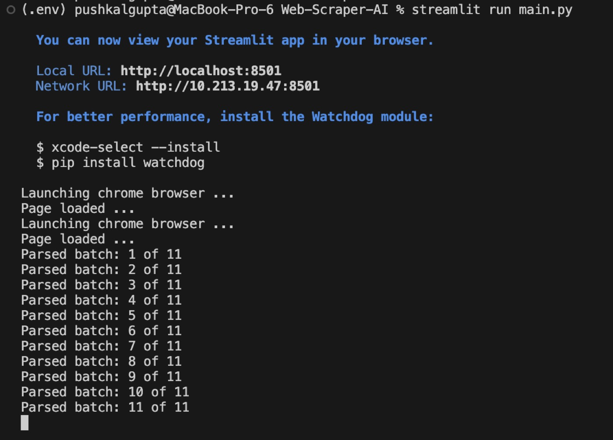
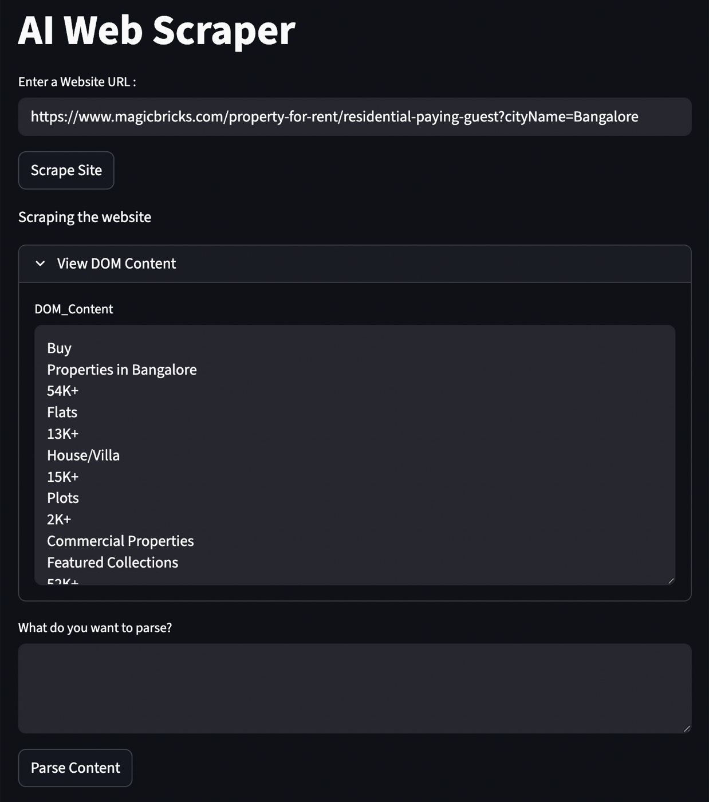
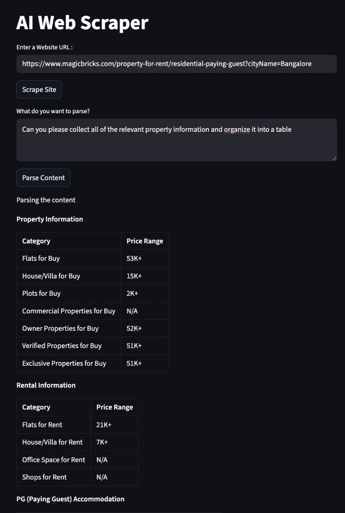
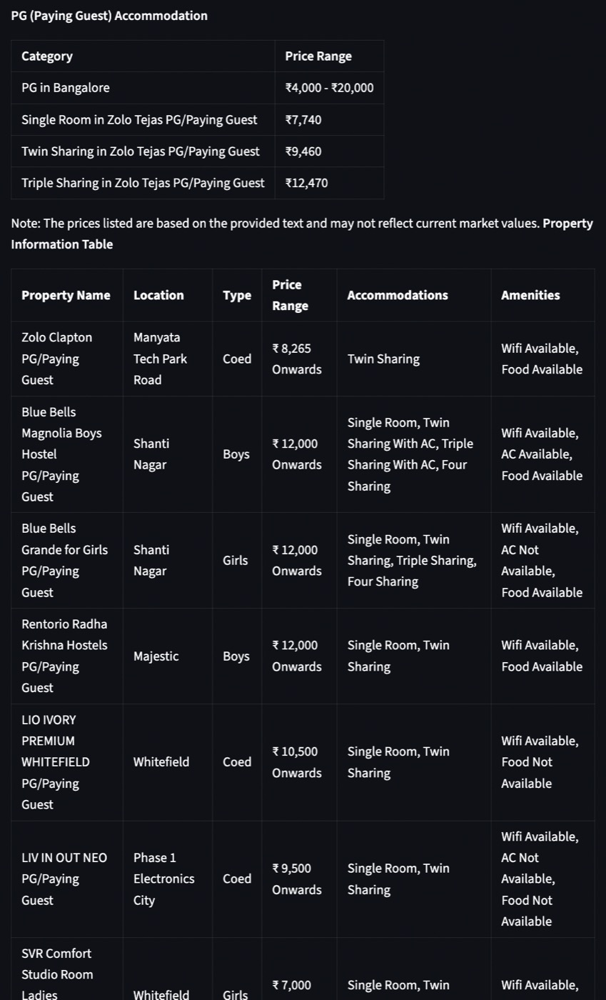
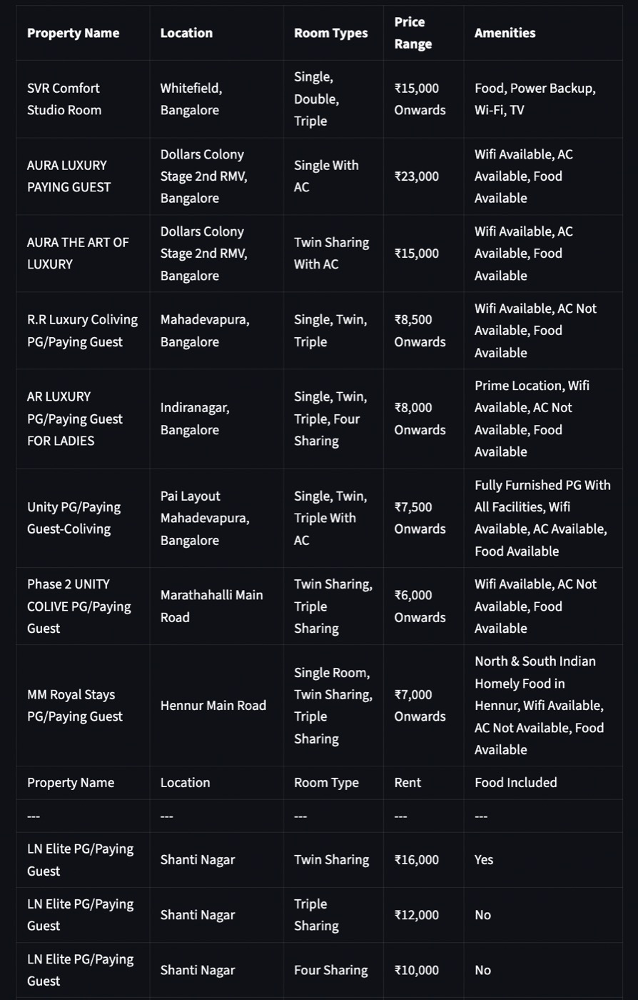
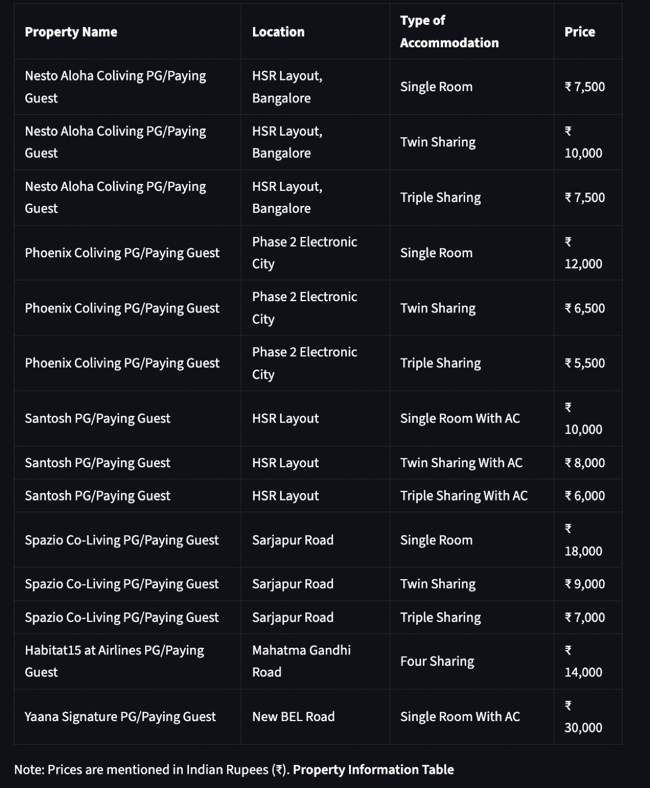

# AI Web Scraper

> Prompt-driven web data extraction using Selenium + Local LLM reasoning (LangChain + Ollama).

A modular AI-assisted scraping framework that combines browser
automation, HTML parsing, and local LLM reasoning to convert
unstructured webpages into structured data.

Instead of writing fragile selectors for every website, this project
extracts page context and lets a local language model interpret,
categorize, and format the information into clean tables and summaries.

The goal is to demonstrate integration of multiple modern tools into a
single working pipeline - not just scraping, but automated
understanding of web content.

---

## Core Idea

Normal scrapers:

```text
read HTML
   ↓
manually parse
   ↓
break when layout changes
```

This system:

```text
read HTML
   ↓
extract semantic content
   ↓
AI understands
   ↓
structured output
```

The scraper handles rendering and retrieval.\
The LLM handles interpretation and structuring.

---

## Integrated Technologies

### Interface

- Streamlit (interactive UI for prompt-based extraction)

### Scraping & Parsing

- Selenium (real browser rendering for JS websites)
- BeautifulSoup4 (DOM parsing)
- lxml / html5lib (robust HTML handling)

### AI Processing

- Ollama (local LLM runtime)
- LangChain (LLM orchestration)
- Llama-3.1 model (semantic interpretation + structuring)

### Environment & Utilities

- Python
- python-dotenv

This repository demonstrates how traditional scraping pipelines can be
upgraded into intelligent data extraction systems using local AI models.

---

## Architecture Flow

```text
User Query
   ↓
Streamlit UI
   ↓
Selenium Browser
   ↓
Raw HTML
   ↓
BeautifulSoup
   ↓
Clean Text
   ↓
LLM Reasoning
   ↓
Structured Tables / Summaries
```

Unlike traditional scrapers, no site-specific CSS/XPath selectors are required.\
The parsing logic is prompt-driven rather than layout-driven, making the system resilient to moderate UI changes.

The LLM receives only cleaned textual content extracted from the page, not the raw HTML, preventing markup noise from affecting reasoning.

---

## Setup Instructions

### 1. Clone the repository

```bash
git clone https://github.com/Pushkal-Gupta/Web-Scraper-AI.git
cd Web-Scraper-AI
```

### 2. Create a virtual environment

```bash
python -m venv .env
source .env/bin/activate  # macOS / Linux
.env\\Scripts\\activate  # Windows
```

### 3. Install dependencies

```bash
pip install -r requirements.txt
```

### 4. Install external runtime dependencies

The code contains direct links/instructions for installing required external dependencies.

### ChromeDriver

```text
https://googlechromelabs.github.io/chrome-for-testing/#stable
```

### Ollama Runtime

```text
Download: https://ollama.com/download
Github: https://github.com/ollama/ollama
```

### Llama-3.1 Model

Download the model:

```bash
ollama pull llama3.1
```

Run locally to verify installation:

```bash
ollama run llama3.1
```

The links are also mentioned in the source code comments to install them
before running the app.

---

## Running the Application

```bash
streamlit run main.py
```

Open the local URL shown in the terminal.

---

## Usage

1.  Enter any webpage URL
2.  Describe what information you want extracted
3.  The system automatically parses and structures the data

Example prompts:

- "Summarize the important information"
- "Create a table of all items"
- "Extract names, prices and features"

The same pipeline works across unrelated websites because the model reasons over text, not DOM structure.

---

## Practical Use Case — Finding Accommodation After Relocation

A common real-world problem:\
A student or working professional relocating to a new city needs to quickly analyze hundreds of listings across dynamic real-estate websites.

These websites:

- load data dynamically
- scatter information across cards
- mix structured and unstructured text
- make manual comparison slow and error-prone

This system converts messy listings into clean comparable data.

---

### Source/Test Website Used

Example dynamic website used for testing:
```text
https://www.magicbricks.com/property-for-rent/residential-paying-guest?cityName=Bangalore
```


---

### Step 1 — Launching the Application

The app starts a browser instance and begins scraping dynamic content.



---

### Step 2 — Extracted DOM Content (After Providing Target Website)

User provides the listing page URL inside the Streamlit UI.\
The system extracts meaningful textual content from the loaded webpage before AI processing.\
URL:
```text
https://www.magicbricks.com/property-for-rent/residential-paying-guest?cityName=Bangalore
```



---

### Step 3 — Natural Language Query

Instead of writing selectors, the user describes the requirement in plain English.\
Query used:

```text
Can you please collect all of the relevant property information and organize it into a table
```



---

### Step 4 — AI Structured Output

The local LLM organizes the extracted data into structured tables that can be compared directly.





---

Result: Raw browsing is transformed into comparable structured data, reducing human decision effort from search → analysis.

---

## What This Project Demonstrates

- Integration of browser automation + NLP + local LLMs
- Turning unstructured web data into structured datasets
- Prompt-driven scraping instead of selector-driven scraping
- Practical LangChain + Ollama usage in a real application
- Building an AI-assisted data extraction pipeline end-to-end

### Key Property

This project is not a site-specific scraper.
It is a generic semantic extraction pipeline.

---

## Notes

This project is intended for educational and demonstration purposes.
Ensure compliance with website policies when scraping external sources.
